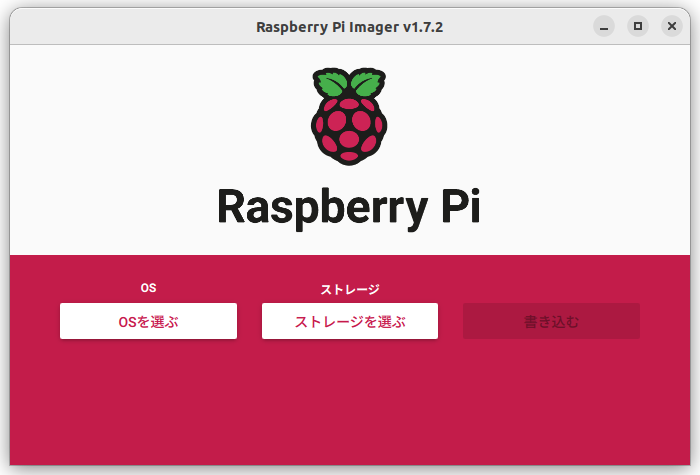
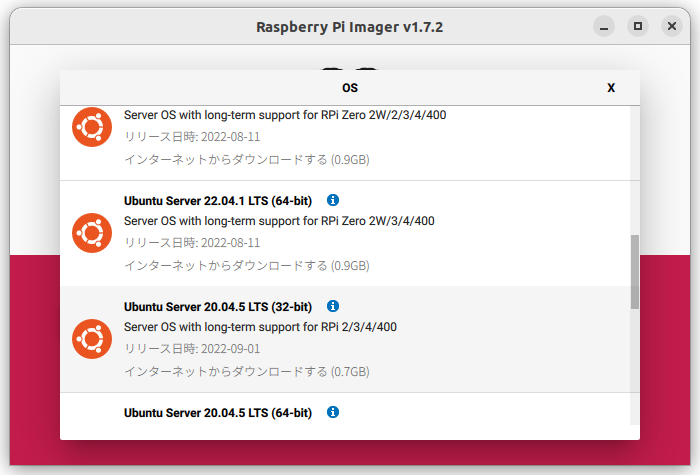

# Install Ubuntu 22.04LTS server onto Raspberry Pi

Ubuntu 22.04LTSをインストールしたPCを作業環境に使用。

## Raspberry Pi 3/4 用のUbuntu Server MicroSDを作る

MicroSDを作るにはRaspberry Pi Imagerを使用する。

Imagerは次のコマンドでインストールする。
```
$ sudo apt install rpi-imager
```
インストールするのはUbuntu Server 22.04 LTS (64-bit)


## Raspberry Piをブートしてパスワードを変更する

作成したMicro SDカードをRaspberry Piに挿入して電源を入れる。
この時、キーボードやモニターを接続する必要はないが、イーサネットケーブルを使ってローカルネットワークに接続する。

ローカルネットワークはDHCPでIPアドレスが各機器に割り振られていることを前提とする。大抵は家庭内や企業内のネットワークはそういう構成であろう。

DHCPで割り振られたIPアドレスは、次のコマンドによって調べることができる。

```
$ nmap -sP 192.168.0.0/24

Starting Nmap 7.80 ( https://nmap.org ) at 2023-02-08 04:33 JST
Nmap scan report for ntt.setup (192.168.0.1)
Host is up (0.0063s latency).
Nmap scan report for 192.168.0.2
Host is up (0.0071s latency).
Nmap scan report for 192.168.0.3
Host is up (0.0060s latency).
Nmap scan report for 192.168.0.4
Host is up (0.057s latency).
Nmap scan report for 192.168.0.6
Host is up (0.055s latency).
Nmap scan report for 192.168.0.7
Host is up (0.0052s latency).
Nmap scan report for 192.168.0.11
Host is up (0.0055s latency).
Nmap scan report for 192.168.0.200
Host is up (0.0020s latency).
Nmap scan report for 192.168.0.202
Host is up (0.0058s latency).
Nmap scan report for 192.168.0.250
Host is up (0.0043s latency).
Nmap done: 256 IP addresses (11 hosts up) scanned in 3.29 seconds

```

```
$ arp -a

? (192.168.0.2) at 98:f1:99:b9:db:d0 [ether] on wlp2s0
? (192.168.0.202) at b8:27:eb:ee:9c:ed [ether] on wlp2s0
? (192.168.0.200) at 00:1f:f3:4e:1e:31 [ether] on wlp2s0
? (192.168.0.6) at 92:1b:cc:a9:f2:f8 [ether] on wlp2s0
? (192.168.0.4) at fe:c8:4d:4e:90:91 [ether] on wlp2s0
? (192.168.0.3) at 2e:12:fe:9b:0a:f2 [ether] on wlp2s0
ntt.setup (192.168.0.1) at 00:3a:9d:6e:d6:70 [ether] on wlp2s0
? (192.168.0.7) at f6:ad:f6:3a:a1:8b [ether] on wlp2s0
_gateway (172.20.10.1) at 3a:53:9c:63:f2:64 [ether] on enx3a539c36e78c
? (172.31.88.35) at 00:ae:57:22:56:d2 [ether] on wlp2s0
? (192.168.0.250) at 08:10:86:5b:bc:04 [ether] on wlp2s0
? (192.168.0.11) at b8:27:eb:ee:9c:ed [ether] on wlp2s0

```
この中からRaspberry Piと思しきIPアドレスに対してsshで接続する。ユーザー名はubuntu、パスワードはubuntuである。
```
$ ssh ubuntu@192.168.0.202
```
こんな感じの画面表示が得られる筈である。
```
ubuntu@192.168.0.202's password: 
Welcome to Ubuntu 22.10 (GNU/Linux 5.19.0-1012-raspi aarch64)

 * Documentation:  https://help.ubuntu.com
 * Management:     https://landscape.canonical.com
 * Support:        https://ubuntu.com/advantage

  System information as of Wed Feb  8 04:35:54 JST 2023

  System load:                      0.03271484375
  Usage of /:                       30.1% of 14.42GB
  Memory usage:                     39%
  Swap usage:                       0%
  Temperature:                      38.6 C
  Processes:                        147
  Users logged in:                  0
  IPv4 address for br-610c09fb5479: 172.18.0.1
  IPv4 address for eth0:            192.168.0.202
  IPv4 address for eth0:            192.168.0.11
  IPv6 address for eth0:            2400:4051:20a0:5300:ba27:ebff:feee:9ced

 * Strictly confined Kubernetes makes edge and IoT secure. Learn how MicroK8s
   just raised the bar for easy, resilient and secure K8s cluster deployment.

   https://ubuntu.com/engage/secure-kubernetes-at-the-edge

0 updates can be applied immediately.


Last login: Tue Feb  7 06:05:07 2023 from 192.168.0.17

```

初めてubuntuユーザーでログインするとパスワードの変更を求められるので、適当かつ安全そうなパスワードに変更する。

## Raspberry Piを固定IPアドレスをにする

Ubuntuをアップデートする。
```
ubuntu@ubuntu:~$ sudo apt update
```

ifconfigコマンドを使いたいのでnet-toolsをインストールする。
```
ubuntu@ubuntu:~$ sudo apt install net-tools
```

ネットワークインターフェイスやアドレス割当状況を確認 

```
ubuntu@ubuntu:~$ ifconfig 
```
Raspberry Piのイーサネットインターフェースはeth0となっている筈である。

netplanの設定ファイルを作る。
```
ubuntu@ubuntu:~$ sudo nano /etc/netplan/99-static_ip.yaml 
```
ファイルの内容。（RasPiのIPアドレスは192.168.0.202、ルーターのIPアドレスが192.168.0.1の場合）
```
network:
    version: 2
    renderer: networkd
    ethernets:
        eth0:
            addresses:
                - 192.168.0.202/24
            nameservers:
                addresses: [8.8.8.8, 192.168.0.1]
            routes:
                - to: default
                  via: 192.168.0.1
```

設定を反映する。
```
ubuntu@ubuntu:~$ sudo netplan apply
```
ここでRaspberry Piを再起動する。
```
ubuntu@ubuntu:~$ sudo reboot
```
## Raspberry Piの初期設定

Raspberry Piにsshで接続する。
```
$ ssh ubuntu@192.168.0.202
```

### システムをアップデートする。
```
ubuntu@ubuntu:~$ sudo apt update && sudo apt upgrade -y
```

### NTPサーバを「NICT」に変更する。
```
ubuntu@ubuntu:~$ sudo sed -i 's/^#NTP=/NTP=ntp.nict.jp/' /etc/systemd/timesyncd.conf && sudo systemctl restart systemd-timesyncd
```

### タイムゾーンを「東京」に変更する。
```
ubuntu@ubuntu:~$ sudo timedatectl set-timezone Asia/Tokyo
```

### ホスト名を変更する。
```
ubuntu@ubuntu:~$ sudo hostnamectl set-hostname ホスト名
```

### mDNSを有効化する。
```
ubuntu@ubuntu:~$ sudo apt install -y avahi-daemon
```
### 再起動する。
```
ubuntu@ubuntu:~$ sudo reboot
```